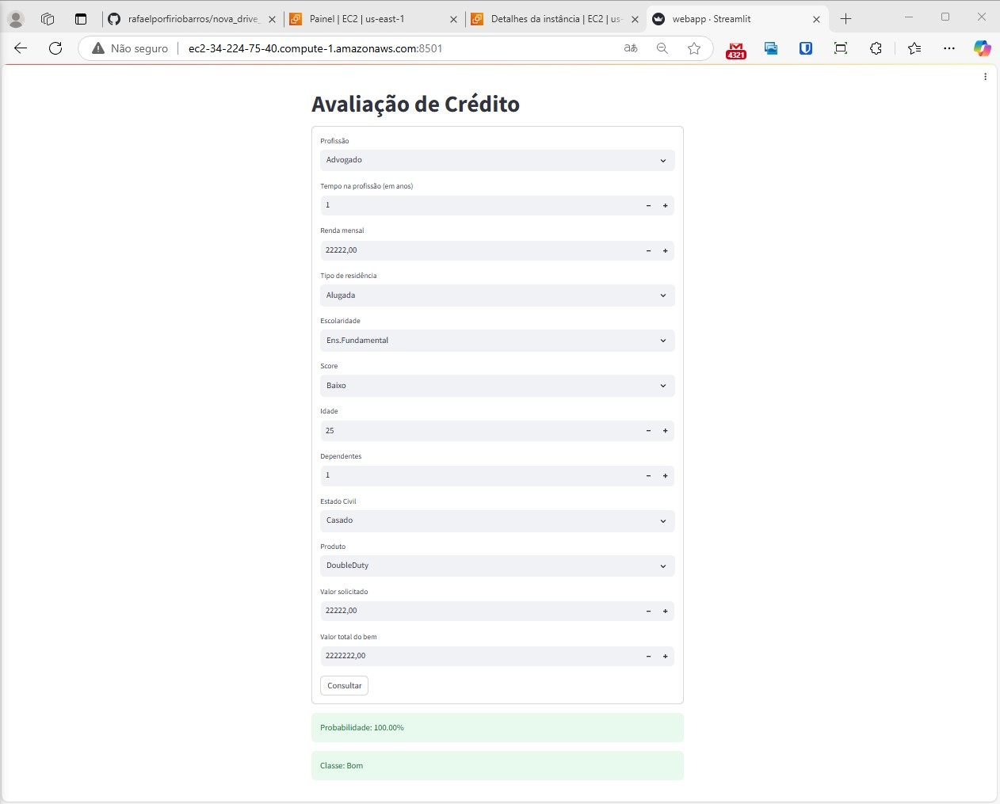

# Projeto de Ciência de Dados End to End: Nova Drive Bank

## 📜 Introdução

A nova Drive é uma montadora de veículos nacional, que produz e exporta carros para o mundo todo.
A empresa nova Drive Bank, que também faz parte do grupo, tem como objetivo  facilitar o acesso a crédito para futuros clientes. O Objetivo desse projeto é 
criar um modelo de machine learning para área de crédito e avaliar o risco de conceder crédito para um novo cliente.

## 🎯 Objetivos do Projeto

- **Conhecer a Empresa**
- **Conectar aos Dados da Empresa**
- **Realizar Análise Exploratória dos Dados**
- **Limpeza, Tratamento e Pré-Processamento de Dados**
- **Criação de Modelo de Machine Learning**
- **Criar API para servir o Modelo**
- **Criar UI para testar e consultar o Modelo**
- **Publicar o Modelo na Web**
- **Testar o consumo do serviço da API**

---

## 🤖 Detalhes do Modelo de Machine Learning

- O modelo de Machine Learning pode ser treinado diretamente com os dados do sistema de concessão de crédito.
- É necessário um desempenho mínimo para o modelo. A precisão mímima para o modelo ser útil é de 70%, mas espera-se pelo menos 80%. 
- O recall mínimo também é de 70%, mas espera-se ter pelo menos 75%.
- O limiar de decisão para as métricas de avaliação do modelo é de 50%, mas seria ideal ajustar esse limiar para refletir o custo de erro, tornando o modelo mais conservador ou não, de acordo com as necessidades da empresa.

## 📝 Detalhes sobre os principais arquivos do projeto

- O arquivo modelcreation.py é o principal arquivo do projeto, nele foram criados as principais ações sobre consultar os dados no banco de dados externo, a criação de funções para tratar erros, os outliers, dividir os dados em treino e teste, fazer normalização, e criar o modelo do tensorflow keras, e também criar o joblib para a implementação do flask.

- O arquivo utils.py são funções de acesso ao banco de dados e funções organizadas sobre tratamento de dados nulos, corrigir erros de digitação, tratar outliers, funções sobre o StandScaler e LabelEncoder e carregamento delas.

- O arquivo api.py é sobre a criação do projeto com o Flask junto com o joblib.

- O arquivo testflask.py é para fazer testes com o flask com dados novos. 

---

## ✅ Webapp Streamlit rodando na Aws

- Na AWS foi criada uma instância no EC2 para disponibilizar o webapp do streamlit conforme a imagem. 

---

## 🛠️ Ferramentas Utilizadas:

   - Flask
   - PostgreSQL
   - Python  
   - Pandas  
   - Matplotlib
   - Streamilit 
   - AWS EC2

